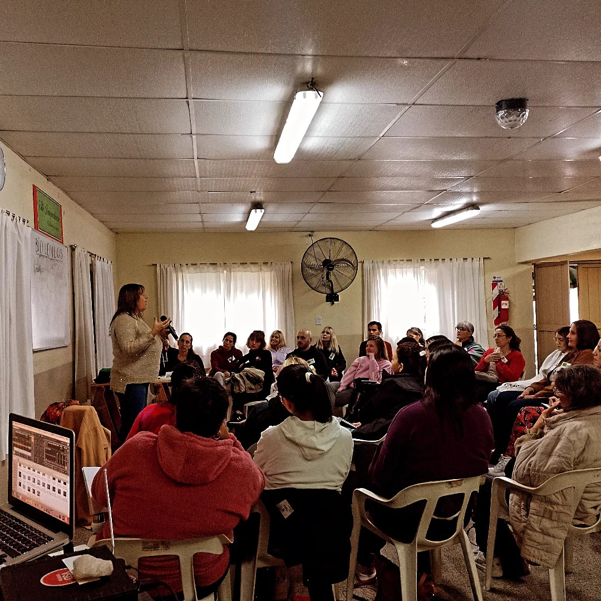
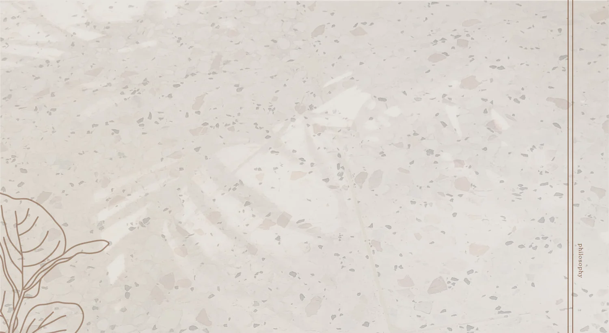

# CURSOR_INSTRUCTIONS.md
> Blueprint for all secondary pages of **Andrea Blangino — Biodecodificación Biológica**  
> Source-verified against: `index.html`, `tailwind-extras.css`, `main.css`, `main.js`  
> Hand this file to Cursor with zero additional context.

---

## ⚠️ PRE-BUILD FLAGS (Inconsistencies & Ambiguities Detected)

Read these before generating any page. They document real conflicts found across the project files.

### FLAG 1 — `main.css` is a legacy design brief, NOT the active stylesheet

`main.css` defines a completely different design system from what `index.html` actually uses:

| Token | `main.css` (legacy) | `index.html` + `tailwind-extras.css` (active) |
|---|---|---|
| Heading font | Cormorant Garamond | **Gilda Display** |
| Body font | DM Sans | **Montserrat** |
| Button classes | `.btn-primary`, `.btn-accent` | Tailwind inline classes + `.cta-accent` |
| Border radius (cards) | `--radius-card: 8px` | `rounded-2xl` (16px) |
| Border radius (buttons) | `--radius-btn: 4px` | `rounded` (4px) ✓ same |

**Resolution**: `main.css` must still be imported (`<link rel="stylesheet" href="assets/css/main.css">`) because it defines critical shared classes that ARE used — specifically `.nav-bar-scrolled`, `.hero-photo-wrap`, `.gold-line`, `.animate-fade-up`, `.service-icon-card`. However, the active visual system is the Tailwind CDN config + `tailwind-extras.css`. Where conflicts exist between the two CSS files on the same class (e.g. `.faq-item`, `.nav-link`), **`tailwind-extras.css` wins** because it loads after.

**Import order in `<head>` must be exactly:**
1. `assets/css/main.css`
2. `assets/css/tailwind-extras.css`

### FLAG 2 — `.nav-bar-scrolled` class is JS-toggled and defined in `main.css`

`main.js` `initNavScroll()` adds/removes `.nav-bar-scrolled` on the `<nav id="nav-bar">` element as the user scrolls past 20px. The visual effect is defined in `main.css`:
```css
.nav-bar.nav-bar-scrolled { box-shadow: 0 2px 20px rgba(0, 0, 0, 0.08); }
```
This requires both `main.css` AND `main.js` to be present. Do not replicate this logic inline.

### FLAG 3 — `formacion-visible` class is JS-toggled

`main.js` `initFormacionHero()` observes `#formacion.formacion-hero` via IntersectionObserver. When the section enters the viewport, it adds `.formacion-visible` to the section element. The animations on `.formacion-hero__content` and `.formacion-hero__media` only fire once this class is present (defined in `tailwind-extras.css`). **On `escuela-de-formacion.html`, the hero section must have `id="formacion"` AND `class="... formacion-hero ..."` for this animation to fire automatically.**

### FLAG 4 — Inline color `#b1873a` vs. design token `#C8A96E`

In `#sobre-mi`, bold text uses `style="color: #b1873a;"` — a warmer/darker gold. This is NOT in the Tailwind config. `main.css` does not define it either. It appears intentional for body-text highlights. **Resolution**: Add `'accent-dark': '#B1873A'` to the Tailwind config block on every page, and use `class="text-accent-dark"` for inline bold highlights instead of inline styles.

### FLAG 5 — WhatsApp number is a placeholder everywhere

Every `wa.me/54911XXXXXXXX` URL is a placeholder. All new pages must include the comment `<!-- PLACEHOLDER: replace WhatsApp number -->` adjacent to any WhatsApp link.

### FLAG 6 — Email obfuscation via Cloudflare

The email in the footer is obfuscated by Cloudflare's proxy automatically on the server. On new pages, write the raw email address — Cloudflare will replace it on deploy. Mark with comment `<!-- PLACEHOLDER: email — Cloudflare will obfuscate on deploy -->`.

### FLAG 7 — `main.js` requires specific IDs and classes to exist

Every function in `main.js` depends on exact DOM selectors. If a page omits any of these, the corresponding feature silently breaks. See the **JS Dependency Map** in Section 1.5.

---

## SECTION 1 — Global Rules (Applied to ALL Pages)

### 1.1 — `<head>` Template

Copy verbatim. Update only `<title>` and `<meta name="description">` per page.

```html
<!DOCTYPE html>
<html lang="es" class="scroll-smooth">
<head>
  <meta charset="UTF-8">
  <meta name="viewport" content="width=device-width, initial-scale=1.0">
  <title>[PAGE TITLE] | Andrea Blangino — Biodecodificación Biológica</title>
  <meta name="description" content="[PAGE META DESCRIPTION]">
  <script src="https://cdn.tailwindcss.com"></script>
  <script>
    tailwind.config = {
      theme: {
        extend: {
          colors: {
            primary: '#2D5A1B',
            'primary-light': '#4A7C35',
            'primary-pale': '#EBF2E4',
            accent: '#C8A96E',
            'accent-dark': '#B1873A',
            separator: '#3D4A35',
            'neutral-dark': '#1C1C1C',
            'neutral-mid': '#5C5C5C',
            'neutral-light': '#F5F3EF',
          },
          fontFamily: {
            serif:   ['"Gilda Display"', 'serif'],
            sans:    ['"Montserrat"', '"Montserrat Fallback"', 'system-ui', 'sans-serif'],
            body:    ['"Montserrat"', '"Montserrat Fallback"', 'system-ui', 'sans-serif'],
            nav:     ['"Source Sans Pro"', 'system-ui', 'sans-serif'],
            display: ['"Gilda Display"', 'serif'],
          },
          maxWidth: { 'container': '1200px' },
        },
      },
    }
  </script>
  <link href="https://fonts.googleapis.com/css2?family=Montserrat:wght@400;500;600;700&family=Source+Sans+Pro:wght@400;500;600;700&family=Gilda+Display&display=swap" rel="stylesheet">
  <link rel="stylesheet" href="https://cdnjs.cloudflare.com/ajax/libs/font-awesome/6.0.0/css/all.min.css" crossorigin="anonymous">
  <!-- CSS load order is critical: main.css first, tailwind-extras.css second (wins on conflicts) -->
  <link rel="stylesheet" href="assets/css/main.css">
  <link rel="stylesheet" href="assets/css/tailwind-extras.css">
</head>
<body class="antialiased font-body text-neutral-dark bg-white overflow-x-hidden">
```

### 1.2 — Navbar

Copy verbatim from `index.html` lines 44–88. On all non-index pages:
- Logo `href` → `"/"`  
- All `#section-id` anchors → `"/#section-id"` (e.g. `href="/#formacion"`)
- The "CONTACTO" CTA → `href="/#contacto"`
- Keep `id="nav-bar"` on the `<nav>` element — required by `main.js`

### 1.3 — Footer

Copy verbatim from `index.html` lines 441–485. On non-index pages, update anchors to `/#` format. Keep `id="contacto"` on the `<footer>` element.

### 1.4 — Closing Scripts

```html
  <script src="assets/js/main.js"></script>
</body>
</html>
```

### 1.5 — JS Dependency Map (from `main.js` source)

`main.js` is a single IIFE with six functions. Each requires specific DOM hooks. **Never rename these IDs or classes.**

| `main.js` Function | Required DOM Selectors | What Breaks If Missing |
|---|---|---|
| `initNav()` | `#nav-trigger` or `.nav-trigger`, `#nav-menu-mobile`, `.nav-menu-backdrop`, `.nav-menu-link`, `.nav-menu-cta` | Hamburger menu, accessibility, Escape key close |
| `initNavScroll()` | `.nav-bar` (the `<nav>` element) | Shadow-on-scroll effect (via `.nav-bar-scrolled`) |
| `initFaq()` | `.faq-trigger`, `.faq-item`, `.faq-content` | FAQ accordion entirely |
| `initCounters()` | `.stat-number[data-counter]` + `data-suffix` attribute | Animated number counters |
| `initFormacionHero()` | `#formacion.formacion-hero` (element must have BOTH) | Fade-in animation on formacion section |
| `initVideoCarousel()` | `#video-carousel`, `#video-carousel-iframe`, `#video-carousel-prev`, `#video-carousel-next`, `.video-carousel__dot` | Video carousel entirely |

**Counter usage syntax** (from `main.js` `animateCounter()`):
```html
<span class="stat-number" data-counter="10" data-suffix="+">0</span>   <!-- renders: 10+ -->
<span class="stat-number" data-counter="5" data-suffix="k+">0</span>   <!-- renders: 5k+ -->
<span class="stat-number">∞</span>                                       <!-- static, no animation -->
```

**Video embed URLs** (hardcoded in `main.js` `VIDEO_EMBEDS` array, in order):
1. `https://www.youtube.com/embed/NetMzf0Xle8?start=3`
2. `https://www.youtube.com/embed/D8xBGy54phQ?start=2`
3. `https://www.youtube.com/embed/0HoeNWtTxhI`
4. `https://www.youtube.com/embed/GGdPz02RkTo`

### 1.6 — Design System (strictly enforce)

**Active color palette** (from Tailwind config in `index.html` + `:root` in `main.css`):

| Token | Hex | Usage |
|---|---|---|
| `primary` | `#2D5A1B` | CTA buttons, links, borders, icons |
| `primary-light` | `#4A7C35` | Button hover state |
| `primary-pale` | `#EBF2E4` | Card icon backgrounds, hover fills, FAQ gradient |
| `accent` | `#C8A96E` | Gold accents, stat numbers, footer headings |
| `accent-dark` | `#B1873A` | Bold inline text highlights (`<strong>`) |
| `separator` | `#3D4A35` | Dark section backgrounds (quote banner, terapias CTA, footer) |
| `neutral-dark` | `#1C1C1C` | Body text, headings |
| `neutral-mid` | `#5C5C5C` | Secondary text, descriptions |
| `neutral-light` | `#F5F3EF` | Section backgrounds, navbar background |

**Active typography** (Tailwind config — these fonts are loaded, these are the ones to use):

| Role | Font | Tailwind class |
|---|---|---|
| Headings / Display | Gilda Display | `font-serif` or `font-display` |
| Body text | Montserrat | `font-body` or `font-sans` |
| Navigation / UI labels | Source Sans Pro | `font-nav` |

> ⚠️ `main.css` imports Cormorant Garamond + DM Sans. These load but are overridden by the Tailwind font stack. Do not use them intentionally in new pages.

**Spacing and layout:**

| Token | Value |
|---|---|
| Max container | `1200px` → `max-w-container mx-auto` |
| Horizontal padding | `px-5 lg:px-20` |
| Section vertical padding | `py-24 md:py-32` |
| Card border radius | `rounded-2xl` (Tailwind = 1rem) |
| Button border radius | `rounded` (Tailwind = 0.25rem, matches `--radius-btn: 4px`) |
| Standard transition | `transition-all duration-300` |
| Card hover | `hover:shadow-lg hover:-translate-y-1 transition-all duration-300` |

### 1.7 — Button Variants

**Primary** (green filled):
```html
<a href="..." class="inline-flex items-center justify-center px-8 py-3.5 bg-primary text-white font-nav text-[16px] leading-[22px] font-normal rounded hover:bg-primary-light transition-colors shadow-md hover:shadow-lg no-underline uppercase">Label</a>
```

**Secondary** (outlined, primary color):
```html
<a href="..." class="inline-flex items-center justify-center gap-2 px-8 py-3.5 border-2 border-primary text-primary font-nav text-[16px] leading-[22px] font-normal rounded hover:bg-primary-pale transition-colors no-underline uppercase">Label <i class="fas fa-arrow-right text-sm"></i></a>
```

**Accent CTA** (gold filled — uses `.cta-accent` class from `tailwind-extras.css`):
```html
<a href="..." class="cta-accent inline-flex items-center justify-center px-8 py-3.5 bg-accent text-white font-nav text-[16px] leading-[22px] font-normal rounded shadow-md no-underline uppercase">Label</a>
```
> `tailwind-extras.css` defines `.cta-accent:hover { background-color: #a88b52; box-shadow: 0 8px 20px rgba(0,0,0,0.25), 0 2px 6px rgba(200,169,110,0.35); }` — do not add inline hover styles.

**Premium gradient** (amber — for Formación sections only):
```html
<a href="..." class="formacion-cta-premium inline-flex items-center justify-center px-10 py-4 bg-gradient-to-r from-amber-400 to-amber-500 text-neutral-dark font-nav text-base font-semibold rounded-xl shadow-lg hover:shadow-xl hover:scale-[1.02] active:scale-[0.98] transition-all duration-300 no-underline uppercase tracking-wide focus-visible:ring-2 focus-visible:ring-amber-300 focus-visible:ring-offset-2">Label</a>
```
> `tailwind-extras.css` defines `.formacion-cta-premium:hover { background: linear-gradient(to right, #fbbf24, #f59e0b); }`.

**Ghost on dark** (white border, for separator backgrounds — uses `.cta-secondary-dark`):
```html
<a href="..." class="cta-secondary-dark inline-flex items-center justify-center px-8 py-3.5 border-2 border-white text-white font-nav text-[16px] leading-[22px] font-normal rounded no-underline uppercase">Label</a>
```
> `tailwind-extras.css` defines `.cta-secondary-dark:hover { background-color: rgba(255,255,255,0.2); }`.

### 1.8 — Card Component

```html
<article class="bg-white rounded-2xl p-6 md:p-8 text-center shadow-sm hover:shadow-lg hover:-translate-y-1 transition-all duration-300 border border-neutral-100">
  <div class="w-14 h-14 mx-auto mb-5 rounded-xl bg-primary-pale/80 flex items-center justify-center text-primary">
    <i class="fas fa-[icon] text-2xl" aria-hidden="true"></i>
  </div>
  <h3 class="font-serif text-xl font-semibold text-neutral-dark mb-3">[Title]</h3>
  <p class="text-neutral-mid text-sm leading-relaxed">[Description]</p>
</article>
```

### 1.9 — Service Icon Card (uses `main.css` `.service-icon-card` class)

For the 3-column services grid (Online / Talleres / Presencial):
```html
<a href="..." class="service-icon-card group bg-white rounded-2xl p-8 text-center no-underline text-neutral-dark block border border-transparent hover:border-primary-pale hover:shadow-lg hover:-translate-y-1 transition-all duration-300">
  <div class="service-icon w-16 h-16 mx-auto mb-5 rounded-xl bg-primary-pale/80 flex items-center justify-center text-neutral-mid group-hover:text-primary group-hover:bg-primary-pale transition-colors">
    <i class="fas fa-[icon] text-3xl" aria-hidden="true"></i>
  </div>
  <h3 class="font-serif text-xl font-semibold mb-2">[Title]</h3>
  <p class="text-neutral-mid text-sm">[Description]</p>
</a>
```
> `main.css` defines `.service-icon-card:hover { transform: translateY(-4px); box-shadow: 0 12px 24px rgba(45,90,27,0.12); }` and `.service-icon-card:hover .service-icon { color: var(--color-primary); }`.

### 1.10 — FAQ Accordion Component

**HTML structure** (JS from `main.js` `initFaq()` handles open/close — do not add custom JS):
```html
<div class="max-w-3xl mx-auto space-y-4">
  <div class="faq-item">
    <button type="button" class="faq-trigger font-nav" aria-expanded="false" aria-controls="faq-N" id="faq-btn-N">
      <span>[Question text]</span>
      <span class="faq-icon">+</span>
    </button>
    <div id="faq-N" class="faq-content" role="region" aria-labelledby="faq-btn-N" aria-hidden="true">
      <div class="faq-content-inner">[Answer text]</div>
    </div>
  </div>
</div>
```
> Replace `N` with sequential integers per page. The `+` rotates 45° to `×` via CSS (`.faq-trigger[aria-expanded="true"] .faq-icon { transform: rotate(45deg); }`) — already defined in both CSS files.

### 1.11 — Section Heading Pattern

```html
<h2 id="[section]-heading" class="font-serif text-3xl md:text-4xl font-semibold text-neutral-dark text-center mb-4 leading-tight">[Heading]</h2>
<p class="text-center text-neutral-mid mb-12 max-w-xl mx-auto font-nav text-base">[Subheading]</p>
```

### 1.12 — Badge / Status Tags

```html
<!-- Próximo (green) -->
<span class="absolute top-4 right-4 bg-primary text-white text-xs font-bold px-3 py-1.5 rounded-full uppercase tracking-wide shadow">Próximo</span>
<!-- Presencial (gold) -->
<span class="absolute top-4 right-4 bg-accent text-white text-xs font-bold px-3 py-1.5 rounded-full uppercase tracking-wide shadow">Presencial</span>
<!-- Grabado (grey) -->
<span class="absolute top-4 right-4 bg-neutral-mid text-white text-xs font-bold px-3 py-1.5 rounded-full uppercase tracking-wide shadow">Grabado</span>
```

### 1.13 — Eyebrow Label

```html
<span class="inline-block text-primary font-semibold text-xs uppercase tracking-[0.2em] mb-4">[Label]</span>
```

### 1.14 — Extra Utilities from `main.css` (available on all pages)

These are defined in `main.css` and can be used anywhere:

```html
<!-- Animated gold divider line -->
<div class="gold-line"></div>
<!-- Produces: height:2px; background: linear-gradient(90deg, transparent, #C8A96E, transparent); width:100px; margin:1.5rem auto -->

<!-- Fade-up entrance animation (apply once, fires immediately on load) -->
<div class="animate-fade-up">...</div>
<!-- Produces: opacity 0→1 + translateY(20px)→0 over 0.8s -->

<!-- Organic blob photo frame (used in hero photo) -->
<div class="hero-photo-wrap">
  
</div>
<!-- Produces: border-radius: 30% 70% 70% 30% / 30% 30% 70% 70%; overflow:hidden -->
```

---

## SECTION 2 — Background Image Convention

### Pattern from `index.html`

Two sections use a photographic background image:
- **HERO** (`#inicio`): `bg-[url('assets/images/home-value-background.jpg')]`
- **SOBRE MÍ** (`#sobre-mi`): same image

**CSS technique** (Tailwind utilities, no overlay):
```html
class="relative overflow-hidden bg-[url('assets/images/home-value-background.jpg')] bg-cover bg-center bg-no-repeat py-24 md:py-32"
```
No `::before` overlay or opacity layer is used. Text contrast relies on the image being naturally light/muted. Keep `text-neutral-dark` on text elements within these sections.

**Rule for all new pages**: Use the placeholder path `assets/images/home-value-background.jpg` for any new section requiring a photo background. The developer will replace each path manually.

### Formación Dark Hero Pattern (different technique)

The `#formacion` section uses a CSS-only dark background — NOT a photo. It layers three elements:

```html
<section id="formacion" class="formacion-hero py-24 md:py-32 text-white relative overflow-hidden" aria-labelledby="...">
  <!-- Layer 1: gradient background -->
  <div class="formacion-hero__bg absolute inset-0 bg-gradient-to-br from-green-900 via-green-800 to-green-700" aria-hidden="true"></div>
  <!-- Layer 2: noise grain texture (SVG data URI defined in tailwind-extras.css .formacion-hero__grain) -->
  <div class="formacion-hero__grain absolute inset-0 opacity-[0.06] pointer-events-none" aria-hidden="true"></div>
  <!-- Layer 3: amber glow blob -->
  <div class="formacion-hero__glow absolute left-0 top-1/2 -translate-y-1/2 w-[500px] h-[400px] bg-amber-400/10 rounded-full blur-[120px] pointer-events-none -translate-x-1/4" aria-hidden="true"></div>
  <!-- Content (must be relative z-10 to sit above the layers) -->
  <div class="... relative z-10">...</div>
</section>
```

The grain SVG is embedded as a data URI in `tailwind-extras.css` under `.formacion-hero__grain` — no separate image file needed.

**Animation**: When `#formacion.formacion-hero` enters the viewport, `main.js` adds `.formacion-visible` to it. This triggers the CSS transitions defined in `tailwind-extras.css` on `.formacion-hero__content` (fade + slide up) and `.formacion-hero__media` (fade + scale) — both defined under `@media (prefers-reduced-motion: no-preference)`.

---

## SECTION 3 — `escuela-de-formacion.html`

### Escuela de Formación — `/escuela-de-formacion`

**Purpose**: Full-page sales landing for the annual training program. Converts visitors (therapists, coaches, health professionals, personal seekers) into enrolled students.

**Navigation Map links to this page**:
- `index.html` HERO: `href="/escuela-de-formacion"` → "Ver Formación Anual"
- `index.html` FORMACIÓN section: `href="/escuela-de-formacion"` → "Quiero Formarme"
- `index.html` FOOTER nav: `href="/escuela-de-formacion"` → "Formación"

---

**Layout Structure**:

1. **Page Hero** — Replicate the dark `formacion-hero` from index exactly. `id="formacion"` AND `class="formacion-hero ..."` are both required for `main.js` to fire the entrance animation. Use amber eyebrow "Lanzamiento 2026", `<h1>` (not `<h2>`) using the same `formacion-hero__title` class, 4 checklist items with SVG checkmarks, amber gradient CTA "Inscribirme Ahora" + ghost CTA "Ver el Programa" (smooth scroll to `#programa`). Right column: `` in `formacion-image-wrap`.

2. **¿Para quién?** — `bg-neutral-light`, section heading, 3 icon cards (Card Component from 1.8). Icons: `fa-hand-holding-heart`, `fa-stethoscope`, `fa-compass`.

3. **El Programa** (`id="programa"`) — white bg. Section heading. Use the FAQ accordion (Section 1.10) for 4 expandable modules. FAQ IDs: `faq-prog-1` through `faq-prog-4`.

4. **Metodología** — `bg-primary-pale/40`. 2-column grid. Left: `<h2>` + paragraph. Right: checklist with `fa-check-circle text-primary` icons inline.

5. **Testimonios** — white bg. Section heading. 3-column card grid. Each: `bg-white rounded-2xl p-6 shadow-sm border border-neutral-100`, circular avatar `w-14 h-14 rounded-full bg-primary-pale/80`, italic quote `font-serif`, name `font-semibold`, role `text-neutral-mid text-xs`.

6. **Inversión** — `bg-neutral-light`. 2 pricing cards side by side. Highlight recommended: add `ring-2 ring-primary shadow-lg` to that card.

7. **Certificación Banner** — `bg-separator text-white py-12` centered. `fa-certificate text-accent text-4xl`, `<h3 class="font-serif">`, short text, accent CTA.

8. **FAQ** — `bg-primary-pale/40`. Section heading. Accordion (Section 1.10). 5 training-specific questions. FAQ IDs: `faq-form-1` through `faq-form-5`.

9. **CTA Final** — `bg-separator text-white py-24`. Centered. Accent CTA "Inscribirme" + ghost CTA "Hablar por WhatsApp" (`href="https://wa.me/[PLACEHOLDER]" <!-- PLACEHOLDER: replace WhatsApp number -->`).

---

**Content Placeholders**:
- `[PLACEHOLDER: Fecha de inicio del programa 2026]`
- `[PLACEHOLDER: Duración total — ej. 12 meses]`
- `[PLACEHOLDER: Modalidad — online/presencial/híbrida]`
- `[PLACEHOLDER: Nombre módulo 1]` through `[PLACEHOLDER: Nombre módulo 4]`
- `[PLACEHOLDER: Contenido módulo N]`
- `[PLACEHOLDER: Precio base]`
- `[PLACEHOLDER: Nombre alumno testimonio N]`, `[PLACEHOLDER: Ocupación]`, `[PLACEHOLDER: Texto testimonio]`
- `[PLACEHOLDER: Link de inscripción]`
- `[PLACEHOLDER: WhatsApp URL]`

---

**Cursor Prompt**:

```
Generate `escuela-de-formacion.html` for Andrea Blangino's Biodecodificación Biológica website.

CRITICAL CSS RULE: Import CSS in this exact order in <head>:
  1. <link rel="stylesheet" href="assets/css/main.css">
  2. <link rel="stylesheet" href="assets/css/tailwind-extras.css">
tailwind-extras.css must load AFTER main.css to correctly override shared class definitions.

GLOBAL RULES:
- Copy exact Navbar from index.html; update all #anchors to /#anchor format; logo href="/"; keep id="nav-bar" on <nav>
- Copy exact Footer from index.html; keep id="contacto" on <footer>
- Same <head> block: Tailwind CDN + config (with accent-dark: '#B1873A' added), Google Fonts, Font Awesome 6, then main.css, then tailwind-extras.css
- Close body with <script src="assets/js/main.js"></script>
- No new colors, fonts, or design patterns

PAGE SECTIONS IN ORDER:

1. HERO: Replicate #formacion section from index.html EXACTLY. Keep id="formacion" — required by main.js initFormacionHero(). Keep class="formacion-hero ...". Replace <h2> with <h1> (same classes: formacion-hero__title formacion-hero__title--spaced font-serif text-4xl md:text-5xl xl:text-6xl font-semibold mb-6). Text: "Formación Integral en <span class='text-amber-300'>Biodecodificación</span> Biológica". Eyebrow: "Lanzamiento 2026" in text-amber-300. Paragraph [PLACEHOLDER]. 4 checklist items with SVG checkmarks (class="formacion-hero__check") — copy SVG from index.html verbatim. CTAs: amber gradient button "Inscribirme Ahora" (href="#inscripcion") + ghost white "Ver el Programa" (href="#programa"). Image:  in formacion-image-wrap div.

2. ¿PARA QUIÉN?: bg-neutral-light py-24 md:py-32. Section heading "¿Para quién es esta formación?". 3 icon cards (exact Card Component). Cards: fa-hand-holding-heart "Terapeutas y coaches" / fa-stethoscope "Profesionales de la salud" / fa-compass "Personas en búsqueda personal". Descriptions [PLACEHOLDER].

3. EL PROGRAMA (id="programa"): white bg py-24 md:py-32. Section heading "El Programa". FAQ accordion (classes: faq-item, faq-trigger, faq-content, faq-content-inner, faq-icon) — 4 items. IDs: faq-prog-1 to faq-prog-4. Titles: [PLACEHOLDER: Módulo 1-4]. Content: [PLACEHOLDER].

4. METODOLOGÍA: bg-primary-pale/40 py-24 md:py-32. Section heading "Metodología". 2-col grid (md:grid-cols-2 gap-12 items-start). Left: h3 font-serif + paragraph. Right: ul with 5 items, each li with fa-check-circle text-primary mr-3 inline icon: "Clases en vivo por Zoom", "Material descargable en PDF", "Grabaciones disponibles 24h", "Supervisión en pares", "Acompañamiento por WhatsApp".

5. TESTIMONIOS: white bg py-24 md:py-32. Section heading "Lo que dicen nuestros alumnos". 3-col grid (md:grid-cols-3 gap-6). Each card: bg-white rounded-2xl p-6 shadow-sm border border-neutral-100. Inside: circular avatar w-14 h-14 rounded-full bg-primary-pale/80 mx-auto mb-4, p class="font-serif italic text-neutral-dark mb-4 text-base" "[PLACEHOLDER: testimonio]", p class="font-semibold text-neutral-dark text-sm" "[PLACEHOLDER: nombre]", span class="text-neutral-mid text-xs" "[PLACEHOLDER: ocupación]".

6. INVERSIÓN (id="inscripcion"): bg-neutral-light py-24 md:py-32. Section heading "Inversión & Modalidades". 2-col grid (md:grid-cols-2 gap-8). Card 1 (base): bg-white rounded-2xl p-8 border border-neutral-100 shadow-sm. Card 2 (recomendado): bg-white rounded-2xl p-8 ring-2 ring-primary shadow-lg. Each card: h3 font-serif text-2xl text-neutral-dark mb-2, price span text-4xl font-serif text-accent mb-6 block "[PLACEHOLDER: precio]", ul with 4 features (fa-check text-primary mr-2), primary CTA "Inscribirme" at bottom.

7. CERTIFICACIÓN: bg-separator text-white py-14. Centered. fa-certificate text-accent text-4xl mb-4 block. h3 class="font-serif text-2xl mb-3" "Certificación oficial al completar". p text-white/80 font-nav mb-6 max-w-md mx-auto. Accent CTA "Consultar detalles" (href="/#contacto").

8. FAQ: bg-primary-pale/40 py-24 md:py-32. Section heading "Preguntas Frecuentes". max-w-3xl mx-auto space-y-4. 5 faq-items (IDs faq-form-1 to faq-form-5). [PLACEHOLDER: preguntas y respuestas sobre la formación].

9. CTA FINAL: bg-separator text-white py-24 md:py-32. Centered. h2 class="font-serif text-3xl md:text-4xl font-semibold mb-4" "¿Lista/o para comenzar tu transformación?". p text-white/90 font-nav mb-8. Two CTAs: accent "Inscribirme" (href="#inscripcion") + ghost white "Hablar por WhatsApp" (href="https://wa.me/[PLACEHOLDER]" <!-- PLACEHOLDER: replace WhatsApp number -->).

CONTENT LANGUAGE: Spanish (Argentina). Tone: warm, professional, empowering.
```

---

## SECTION 4 — `terapias.html`

### Terapias — `/terapias`

**Purpose**: Individual therapy sessions page. Explains online and in-person modalities, process, session duration, pricing, and booking. Target: individuals seeking personal healing.

**Navigation Map links to this page**:
- `index.html` Services grid: `href="/terapias#online"` and `href="/terapias#presencial"`
- **Required anchors**: `id="online"` and `id="presencial"` must exist in the page

---

**Layout Structure**:

1. **Page Hero** — bg-image pattern (Section 2). 2-column: left text (`<h1>` with eyebrow, paragraph, two CTAs), right: `` in `w-full max-w-md aspect-[4/5] rounded-[2.5rem] overflow-hidden shadow-2xl bg-primary-pale/50`.

2. **¿Cómo funciona?** — `bg-neutral-light`. 3-step process. Numbered cards using the Card Component (replace icon div with large number in `font-serif text-4xl text-primary`).

3. **Sesiones Online** (`id="online"`) — white bg. 2-column. Left: content (icon, `<h2>`, description, checklist, duration, price, CTA). Right: image placeholder.

4. **Consultorio Presencial** (`id="presencial"`) — `bg-neutral-light`. 2-column reversed. Same structure + location placeholder.

5. **¿Qué trabajamos?** — white bg. 4-column icon card grid. Topics: Síntomas físicos (`fa-heartbeat`), Conflictos emocionales (`fa-brain`), Árbol transgeneracional (`fa-sitemap`), Proyecto Sentido (`fa-seedling`).

6. **Testimonios** — `bg-primary-pale/40`. 3 testimonial cards.

7. **FAQ** — white bg. 4–5 session-specific accordion items. IDs: `faq-ter-1` through `faq-ter-5`.

8. **CTA Final** — `bg-separator text-white`. Exact same markup as `#terapias` CTA section in `index.html`.

---

**Content Placeholders**:
- `[PLACEHOLDER: Duración sesión — ej. 90 minutos]`
- `[PLACEHOLDER: Precio sesión online]`
- `[PLACEHOLDER: Precio sesión presencial]`
- `[PLACEHOLDER: Dirección consultorio]`
- `[PLACEHOLDER: Link de reserva]`
- `[PLACEHOLDER: WhatsApp URL]`

---

**Cursor Prompt**:

```
Generate `terapias.html` for Andrea Blangino's Biodecodificación Biológica website.

CRITICAL CSS RULE: Import CSS in this exact order in <head>:
  1. <link rel="stylesheet" href="assets/css/main.css">
  2. <link rel="stylesheet" href="assets/css/tailwind-extras.css">

GLOBAL RULES: Exact Navbar (hrefs /#), exact Footer (id="contacto"), same <head> with accent-dark in Tailwind config, main.js at closing body. No new colors or fonts.

PAGE SECTIONS IN ORDER:

1. HERO: bg-[url('assets/images/home-value-background.jpg')] bg-cover bg-center bg-no-repeat py-24 md:py-32. 2-col grid (md:grid-cols-2 gap-12 items-center). Left: eyebrow span "Terapias Individuales" (text-primary uppercase tracking-[0.2em] text-xs font-semibold mb-4 inline-block), h1 class="font-display text-[48px] font-normal leading-[72px] text-neutral-dark mb-6" "Acompañamiento personalizado para tu proceso de sanación", p class="text-neutral-mid text-lg leading-relaxed mb-8 max-w-md font-nav" [PLACEHOLDER], two buttons: primary "Reservar Sesión Online" (href="#online") + secondary "Consulta Presencial" (href="#presencial" with arrow icon). Right: div class="w-full max-w-md aspect-[4/5] rounded-[2.5rem] overflow-hidden shadow-2xl bg-primary-pale/50" with .

2. ¿CÓMO FUNCIONA?: bg-neutral-light py-24 md:py-32. Section heading "¿Cómo funciona una sesión?". 3-col card grid (md:grid-cols-3 gap-6). Each card: bg-white rounded-2xl p-8 text-center shadow-sm border border-neutral-100. Replace icon div with: span class="font-serif text-5xl font-semibold text-primary/20 block mb-4" "01" / "02" / "03". h3 font-serif text-xl. p text-neutral-mid text-sm. Texts: "Primera consulta — Exploramos tu situación, síntoma o conflicto." / "Identificación — Buscamos el shock biológico y su sentido biológico." / "Desactivación — Trabajamos la resolución y el cierre consciente del programa."

3. SESIONES ONLINE (id="online"): white bg py-24 md:py-32. 2-col (md:grid-cols-2 gap-12 items-center). Left: fa-desktop text-primary text-4xl mb-4, h2 font-serif text-3xl font-semibold text-neutral-dark mb-4 "Sesiones Online", paragraph, ul space-y-3 (4 li with fa-check-circle text-primary mr-3): "Sin desplazamientos, desde tu hogar" / "Zoom con cámara y micrófono" / "Link y recordatorio por email" / "Posibilidad de grabar la sesión". Below: fa-clock + "[PLACEHOLDER: 90 min]", fa-tag + "[PLACEHOLDER: precio]". Primary CTA "Reservar Online" (href="/#contacto"). Right: div class="aspect-[4/3] rounded-2xl overflow-hidden bg-primary-pale/50 shadow-xl" with .

4. CONSULTORIO PRESENCIAL (id="presencial"): bg-neutral-light py-24 md:py-32. Same 2-col REVERSED (image left, content right). img src="assets/images/Andrea-picture-2.jpg" in rounded-2xl overflow-hidden shadow-xl. fa-door-open, h2 "Consultorio Presencial". Same structure. Add fa-map-marker-alt + "[PLACEHOLDER: Dirección]". Accent CTA "Consultar Disponibilidad" (href="https://wa.me/[PLACEHOLDER]" <!-- PLACEHOLDER: WhatsApp number -->).

5. ¿QUÉ TRABAJAMOS?: white bg py-24 md:py-32. Section heading "¿Qué trabajamos en sesión?". 4-col card grid (md:grid-cols-2 lg:grid-cols-4 gap-6). Use exact Card Component. Cards: fa-heartbeat "Síntomas físicos" / fa-brain "Conflictos emocionales" / fa-sitemap "Árbol transgeneracional" / fa-seedling "Proyecto Sentido". Descriptions [PLACEHOLDER].

6. TESTIMONIOS: bg-primary-pale/40 py-24 md:py-32. Section heading "Experiencias de personas acompañadas". 3-col (md:grid-cols-3 gap-6). Each: bg-white rounded-2xl p-6 shadow-sm border border-neutral-100. Avatar w-14 h-14 rounded-full bg-primary-pale/80 mx-auto mb-4. Font-serif italic quote. Name font-semibold. Role text-xs text-neutral-mid. [PLACEHOLDER].

7. FAQ: white bg py-24 md:py-32. Section heading "Preguntas sobre las sesiones". Reuse faq-item accordion. Copy these 4 items verbatim from index.html FAQ: ¿Qué es la Biodecodificación?, ¿Necesito diagnóstico médico previo?, ¿Cuántas sesiones se necesitan?, ¿Cómo son las sesiones online?. IDs: faq-ter-1 to faq-ter-4.

8. CTA FINAL: bg-separator text-white py-24 md:py-32 text-center. Copy EXACT markup of #terapias section from index.html: h2 "¿Querés trabajar en tu proceso personal?", p text-white/90 text-lg max-w-xl mx-auto mb-8 font-nav, flex gap-4 justify-center: accent CTA "Sesión Online" (href="/#contacto") + ghost "Consulta Presencial" (href="https://wa.me/[PLACEHOLDER]" <!-- PLACEHOLDER: WhatsApp number -->).

CONTENT LANGUAGE: Spanish (Argentina).
```

---

## SECTION 5 — `talleres.html`

### Talleres & Workshops — `/talleres`

**Purpose**: Full workshop catalog with upcoming events, recorded workshops, and complete detail sections per workshop. Enables filtering by status.

**Navigation Map links to this page**:
- `index.html` Talleres section heading: `href="/talleres"` → "Ver calendario completo"
- `index.html` Cards: `href="/talleres#dinero"`, `href="/talleres#pareja"`, `href="/talleres#sobrepeso"`
- **Required anchors**: `id="dinero"`, `id="pareja"`, `id="sobrepeso"`

---

**Content Placeholders**:

| Workshop | Image | Title | Status |
|---|---|---|---|
| `#dinero` | `assets/images/abundancia.png` | Sanando la Relación con el Dinero | `proximo` |
| `#pareja` | `assets/images/limpieza-energetica.png` | Limpieza Energética y Códigos Sagrados | `presencial` |
| `#sobrepeso` | `assets/images/nino-herido.png` | Sana tu niño herido | `grabado` |
| `#taller-4` | `assets/images/home-value-background.jpg` | `[PLACEHOLDER: título]` | `[PLACEHOLDER]` |
| `#taller-5` | `assets/images/home-value-background.jpg` | `[PLACEHOLDER: título]` | `[PLACEHOLDER]` |
| `#taller-6` | `assets/images/home-value-background.jpg` | `[PLACEHOLDER: título]` | `[PLACEHOLDER]` |

Per-workshop: `[PLACEHOLDER: Fecha]`, `[PLACEHOLDER: Duración]`, `[PLACEHOLDER: Precio]`, `[PLACEHOLDER: Link de inscripción]`, `[PLACEHOLDER: 4 items ¿qué aprenderás?]`.

---

**Cursor Prompt**:

```
Generate `talleres.html` for Andrea Blangino's Biodecodificación Biológica website.

CRITICAL CSS RULE: Import CSS in this exact order:
  1. <link rel="stylesheet" href="assets/css/main.css">
  2. <link rel="stylesheet" href="assets/css/tailwind-extras.css">

GLOBAL RULES: Exact Navbar (hrefs /#), exact Footer (id="contacto"), same <head>, main.js at closing body. No new colors or fonts.

PAGE SECTIONS IN ORDER:

1. HERO: bg-separator text-white py-20 md:py-28. max-w-container mx-auto px-5 lg:px-20 text-center. Eyebrow span class="inline-block text-accent font-semibold text-xs uppercase tracking-[0.2em] mb-4". h1 class="font-serif text-4xl md:text-5xl font-semibold mb-4 text-white" "Talleres & Workshops". p class="text-white/80 font-nav text-lg max-w-xl mx-auto mb-10". Filter pills: div class="flex flex-wrap justify-center gap-3": 4 <button> elements, class="filter-pill font-nav text-sm px-5 py-2 rounded-full transition-colors cursor-pointer", data-filter="todos|proximo|presencial|grabado". Initial active pill (Todos): add bg-accent text-white classes. Inactive pills: bg-white/10 text-white/80.

2. WORKSHOP GRID: white bg py-24 md:py-32. max-w-container. grid md:grid-cols-3 gap-8. 6 article cards. Each: <article class="group" data-status="[proximo|presencial|grabado]" id="[slug]">. Use EXACT card markup from index.html talleres section for each (overflow-hidden rounded-2xl mb-4 relative aspect-video, img with group-hover:scale-105, badge, font-serif h3, text-neutral-mid p line-clamp-2, "Ver detalles" span with arrow). Cards 1-3: real data. Cards 4-6: [PLACEHOLDER] with img src="assets/images/home-value-background.jpg".

3. FILTER JS: Add <script> block before closing </body> (before main.js script tag):
(function() {
  var pills = document.querySelectorAll('.filter-pill');
  pills.forEach(function(btn) {
    btn.addEventListener('click', function() {
      var filter = btn.dataset.filter;
      document.querySelectorAll('[data-status]').forEach(function(card) {
        card.style.display = (filter === 'todos' || card.dataset.status === filter) ? '' : 'none';
      });
      pills.forEach(function(b) {
        b.classList.remove('bg-accent','text-white');
        b.classList.add('bg-white/10','text-white/80');
      });
      btn.classList.remove('bg-white/10','text-white/80');
      btn.classList.add('bg-accent','text-white');
    });
  });
})();

4. DETAIL — DINERO (id="dinero"): bg-neutral-light py-24 md:py-32. 2-col (md:grid-cols-2 gap-12 items-start). Left: . Right: badge "Próximo" (bg-primary), h2 font-serif text-3xl font-semibold mb-4, p text-neutral-mid leading-relaxed mb-6 (from index + [PLACEHOLDER]), h3 font-serif text-lg font-semibold mb-4 "¿Qué aprenderás?", ul space-y-3 with 4 li (SVG checkmark class="formacion-hero__check" + span [PLACEHOLDER x4]), div mt-6 flex gap-6 text-sm text-neutral-mid (fa-clock "[PLACEHOLDER: duración]" + fa-calendar "[PLACEHOLDER: fecha]"), p font-serif text-2xl text-accent font-semibold mt-4 "[PLACEHOLDER: precio]", div mt-6 flex gap-4: primary CTA "Inscribirme" (href="[PLACEHOLDER]") + accent CTA "Consultar" (href="https://wa.me/[PLACEHOLDER]" <!-- PLACEHOLDER: WhatsApp number -->).

5. DETAIL — PAREJA (id="pareja"): white bg py-24 md:py-32. Same 2-col REVERSED. img src="assets/images/limpieza-energetica.png". Badge "Presencial" (bg-accent). h2 "Limpieza Energética y Códigos Sagrados". Same structure as above.

6. DETAIL — SOBREPESO (id="sobrepeso"): bg-neutral-light py-24 md:py-32. Same 2-col. img src="assets/images/nino-herido.png". Badge "Grabado" (bg-neutral-mid). h2 "Sana tu niño herido". Change CTA to accent "Acceder a la grabación". Remove date field, replace with "Disponible ahora" label.

7. CTA FINAL: bg-separator text-white py-20 md:py-24. Centered. h2 font-serif text-3xl font-semibold mb-4 text-white "¿Querés que te avisemos del próximo taller?". p text-white/80 font-nav mb-8 max-w-md mx-auto. flex gap-4 justify-center: accent CTA "Escribirme por WhatsApp" (href="https://wa.me/[PLACEHOLDER]" <!-- PLACEHOLDER: WhatsApp number -->) + ghost CTA "Volver al inicio" (href="/").

CONTENT LANGUAGE: Spanish (Argentina).
```

---

## SECTION 6 — `sobre-mi.html`

### Sobre Mí — `/sobre-mi`

**Purpose**: Full biographical page. Builds trust via Andrea's story, credentials, and philosophy. Ends with session booking CTA.

**Navigation Map links to this page**:
- `index.html` Sobre Mí section: `href="/sobre-mi"` → "Conocer más sobre mí"

---

**Content Placeholders**:
- Use exact bio paragraphs from `index.html` `#sobre-mi` section as starting content
- `[PLACEHOLDER: Bio completa — párrafo 3 y siguientes]`
- `[PLACEHOLDER: Hitos del timeline con año]` (confirmed: 2016 = inicio Biodecodificación)
- `[PLACEHOLDER: Certificaciones adicionales]`
- `[PLACEHOLDER: Tagline personal en Hero]`

---

**Cursor Prompt**:

```
Generate `sobre-mi.html` for Andrea Blangino's Biodecodificación Biológica website.

CRITICAL CSS RULE: Import CSS in this exact order:
  1. <link rel="stylesheet" href="assets/css/main.css">
  2. <link rel="stylesheet" href="assets/css/tailwind-extras.css">

GLOBAL RULES: Exact Navbar (hrefs /#), exact Footer, same <head> with accent-dark '#B1873A' in Tailwind config, main.js at closing body.

IMPORTANT: In this page, all highlighted <strong> terms must use class="text-accent-dark" instead of inline style="color: #b1873a;". This is the corrected consistent pattern.

PAGE SECTIONS IN ORDER:

1. HERO: bg-[url('assets/images/home-value-background.jpg')] bg-cover bg-center bg-no-repeat py-24 md:py-32. 2-col grid (md:grid-cols-2 gap-12 items-center). Left: eyebrow "Terapeuta Holística" (text-primary uppercase tracking-[0.2em] text-xs font-semibold mb-4 inline-block), h1 class="font-display text-[48px] font-normal leading-[72px] text-neutral-dark mb-6" "Hola, soy Andrea Blangino", p class="text-neutral-mid text-lg leading-relaxed mb-8 max-w-md font-nav" "[PLACEHOLDER: Tagline personal]", primary CTA "Reservar una sesión" (href="/#contacto"). Right: div class="w-full max-w-md aspect-[4/5] rounded-[2.5rem] overflow-hidden shadow-2xl bg-primary-pale/50" with .

2. MI HISTORIA: white bg py-24 md:py-32. div class="max-w-3xl mx-auto px-5". h2 class="font-serif text-3xl md:text-4xl font-semibold text-neutral-dark mb-10 text-center" "Mi Historia". Copy the 2 bio paragraphs from index.html #sobre-mi section VERBATIM, replacing any inline style="color: #b1873a;" with class="text-accent-dark". Add [PLACEHOLDER: párrafo 3+]. Then: p class="font-body italic text-xl text-neutral-dark mt-8 text-center" ""Tu sistema es el mapa hacia tu tesoro interior."". Then: .

3. STATS: py-14 bg-white border-y border-neutral-200. div class="max-w-container mx-auto px-5 lg:px-20". grid grid-cols-3 gap-6 text-center. Replicate EXACT stat markup from index.html #sobre-mi:
  <span class="stat-number block text-3xl md:text-4xl font-serif font-semibold mb-1 text-accent" data-counter="10" data-suffix="+">0</span>
  <span class="text-neutral-mid text-xs uppercase tracking-widest">Años de experiencia</span>
  — same for data-counter="5" data-suffix="k+" / and static ∞ (no data-counter). main.js handles the animation automatically on scroll.

4. FORMACIÓN Y CREDENCIALES: bg-neutral-light py-24 md:py-32. Section heading "Formación y Credenciales". 2-col grid (md:grid-cols-2 gap-12 items-start). Left: div class="space-y-6" — timeline: each item is div class="flex gap-4 items-start": span class="text-accent font-semibold font-nav text-sm w-16 shrink-0 pt-0.5" "[año]" + div (p font-semibold text-neutral-dark text-sm + p text-neutral-mid text-sm). Timeline items: [2016 — "Inicio en Biodecodificación Biológica"] + [PLACEHOLDER: otros hitos con año]. Right: div class="grid grid-cols-2 gap-4" — certification badge cards: bg-white rounded-2xl p-5 text-center shadow-sm border border-neutral-100 — fa-certificate text-accent text-2xl mb-3 + h4 font-serif text-neutral-dark text-base font-semibold + span text-neutral-mid text-xs. [PLACEHOLDER: Certificación N].

5. MI FILOSOFÍA: bg-separator text-white py-24 md:py-32. max-w-container mx-auto px-5 lg:px-20. text-center mb-12: p class="font-serif italic text-2xl md:text-3xl text-white leading-snug" ""Tu sistema es el mapa hacia tu tesoro interior."". div class="gold-line"></div> (uses main.css .gold-line). 3-col grid (md:grid-cols-3 gap-6): each card bg-white/10 border border-white/20 rounded-2xl p-6 text-center. Icon text-accent text-3xl mb-4. h3 font-serif text-xl font-semibold mb-3 text-white. p text-white/80 text-sm font-nav leading-relaxed. Cards: fa-comment-medical "El síntoma como mensaje" / fa-sitemap "Transgeneracional y linaje" / fa-sun "Conciencia y empoderamiento". [PLACEHOLDER: descripción por pilar].

6. CTA FINAL: bg-separator text-white py-24 md:py-32. Centered. h2 font-serif text-3xl md:text-4xl font-semibold mb-4 "¿Querés comenzar tu proceso?". p text-white/90 font-nav text-lg mb-8 max-w-xl mx-auto. flex gap-4 justify-center flex-wrap: accent CTA "Reservar sesión" (href="/#contacto") + ghost CTA "Ver terapias" (href="/terapias").

CONTENT LANGUAGE: Spanish (Argentina).
```

---

## SECTION 7 — `politica-privacidad.html`

### Política de Privacidad — `/politica-privacidad`

**Purpose**: Legal compliance page (Argentine Ley 25.326 / GDPR). Static, content-first, minimal visual complexity.

**Navigation Map links to this page**:
- `index.html` Footer: `href="/politica-privacidad"` → "Política de privacidad"

---

**Cursor Prompt**:

```
Generate `politica-privacidad.html` for Andrea Blangino's Biodecodificación Biológica website.

CRITICAL CSS RULE: Import CSS in this exact order:
  1. <link rel="stylesheet" href="assets/css/main.css">
  2. <link rel="stylesheet" href="assets/css/tailwind-extras.css">

GLOBAL RULES: Exact Navbar (hrefs /#), exact Footer, same <head>, main.js at closing body.

PAGE SECTIONS IN ORDER:

1. HERO: bg-neutral-light py-14 md:py-18. max-w-container mx-auto px-5 lg:px-20 text-center. h1 class="font-serif text-3xl md:text-4xl text-neutral-dark mb-2" "Política de Privacidad". p class="font-nav text-neutral-mid text-sm" "Última actualización: [PLACEHOLDER: dd/mm/aaaa]".

2. CONTENT: white bg py-14 md:py-18. div class="max-w-3xl mx-auto px-5". Each section: h2 class="font-serif text-2xl text-neutral-dark mb-4 mt-10" + content p or ul class="text-neutral-mid font-nav leading-relaxed mb-4". Inline links: class="text-primary hover:text-primary-light underline". Separate sections with <hr class="border-neutral-200 my-8">.

  Sections:
  - "1. Responsable del tratamiento" → [PLACEHOLDER: nombre completo, CUIT, domicilio, email <!-- PLACEHOLDER: email — Cloudflare will obfuscate on deploy -->]
  - "2. Datos que recopilamos" → ul list-disc list-inside space-y-2: nombre y apellido, email, teléfono, datos de navegación. [PLACEHOLDER: ampliar]
  - "3. Finalidad del tratamiento" → [PLACEHOLDER: gestión de consultas, envío de info, cumplimiento legal]
  - "4. Base legal" → [PLACEHOLDER: Ley 25.326 Argentina / consentimiento del titular]
  - "5. Cookies" → [PLACEHOLDER: tipos de cookies, política de terceros]
  - "6. Derechos del titular" → acceso, rectificación, cancelación, oposición. Contacto: [PLACEHOLDER: email <!-- PLACEHOLDER: email — Cloudflare will obfuscate on deploy -->]
  - "7. Contacto" → email [PLACEHOLDER] + WhatsApp +5493541574635

CONTENT LANGUAGE: Spanish (Argentina). Legal, clear, no decorative CTAs beyond footer.
```

---

## APPENDIX A — Asset Reference Map

| Asset | Used In |
|---|---|
| `assets/images/home-value-background.jpg` | index HERO, index SOBRE MÍ, sobre-mi HERO, terapias HERO, bg placeholders |
| `assets/images/Andrea-picture.jpg` | index HERO, terapias HERO, sobre-mi HERO |
| `assets/images/Andrea-picture-2.jpg` | index SOBRE MÍ, sobre-mi MI HISTORIA, terapias PRESENCIAL |
| `assets/images/talller.jpg` | index FORMACIÓN, escuela-de-formacion HERO |
| `assets/images/abundancia.png` | index TALLERES card 1, talleres `#dinero` |
| `assets/images/limpieza-energetica.png` | index TALLERES card 2, talleres `#pareja` |
| `assets/images/nino-herido.png` | index TALLERES card 3, talleres `#sobrepeso` |
| `assets/images/logo.svg` | Navbar (all pages) |
| `assets/css/main.css` | All pages `<head>` — **load first** |
| `assets/css/tailwind-extras.css` | All pages `<head>` — **load second** |
| `assets/js/main.js` | All pages closing `<body>` |

---

## APPENDIX B — Inter-Page Link Map

| From | Link text | href | Target |
|---|---|---|---|
| All pages — Navbar logo | Andrea Blangino | `/` | index.html |
| All pages — Navbar | INICIO | `/#inicio` | index `#inicio` |
| All pages — Navbar | FORMACIÓN | `/#formacion` | index `#formacion` |
| All pages — Navbar | TALLERES | `/#talleres` | index `#talleres` |
| All pages — Navbar | TERAPIAS | `/#terapias` | index `#terapias` |
| All pages — Navbar | SOBRE MÍ | `/#sobre-mi` | index `#sobre-mi` |
| All pages — Navbar CTA | CONTACTO | `/#contacto` | index footer |
| All pages — Footer nav | Formación | `/escuela-de-formacion` | escuela-de-formacion.html |
| All pages — Footer nav | Talleres | `/#talleres` | index `#talleres` |
| All pages — Footer nav | Terapias | `/#terapias` | index `#terapias` |
| All pages — Footer nav | Sobre Mí | `/#sobre-mi` | index `#sobre-mi` |
| All pages — Footer | Política de privacidad | `/politica-privacidad` | politica-privacidad.html |
| `index.html` | Ver Formación Anual | `/escuela-de-formacion` | escuela-de-formacion.html |
| `index.html` | Quiero Formarme | `/escuela-de-formacion` | escuela-de-formacion.html |
| `index.html` | Sesiones Online card | `/terapias#online` | terapias.html `#online` |
| `index.html` | Consultorio Presencial card | `/terapias#presencial` | terapias.html `#presencial` |
| `index.html` | Ver calendario completo | `/talleres` | talleres.html |
| `index.html` | Taller Dinero card | `/talleres#dinero` | talleres.html `#dinero` |
| `index.html` | Taller Pareja card | `/talleres#pareja` | talleres.html `#pareja` |
| `index.html` | Taller Sobrepeso card | `/talleres#sobrepeso` | talleres.html `#sobrepeso` |
| `index.html` | Conocer más sobre mí | `/sobre-mi` | sobre-mi.html |
| `sobre-mi.html` | Ver terapias | `/terapias` | terapias.html |

---

## APPENDIX C — CSS Class Conflict Reference

Where the same class exists in both `main.css` and `tailwind-extras.css`, `tailwind-extras.css` always wins (loads last). This table documents every conflict so Cursor doesn't introduce duplicates or regressions:

| Class | `main.css` behavior | `tailwind-extras.css` behavior (wins) |
|---|---|---|
| `.faq-item` | `border-radius: 8px; border: 1px solid rgba(0,0,0,0.08)` | `border-radius: 0.75rem; border: 1px solid rgba(45,90,27,0.12); box-shadow: 0 1px 3px rgba(45,90,27,0.06)` |
| `.faq-trigger` | Green hover bg, focus outline | Same + `border-bottom: 2px solid #EBF2E4` + active state with green border |
| `.faq-content` | `transition: max-height 0.3s ease` | Same + `background: linear-gradient(to bottom, rgba(235,242,228,0.35), #fff)` |
| `.faq-content-inner` | `padding: 0 1.25rem 1.25rem` | `padding: 1.25rem` (all sides) |
| `.nav-link` | Sliding underline `width: 0 → 100%` | `.nav-link-tailwind` uses `scaleX(0 → 1)` — both achieve same visual |
| `.nav-menu-link` | `border-radius: 4px`, green hover | Same behavior, `border-radius: 0.5rem` |
| `.nav-menu-cta` | `border-radius: 4px` | `border-radius: 0.5rem` |
| `.stat-number` | `font-family: var(--font-heading)` (Cormorant) | Same `#C8A96E` color; Tailwind `font-serif` (Gilda Display) overrides font via `class` attribute |
| `.nav-bar` | `background: rgba(255,255,255,0.97); backdrop-filter: blur(8px)` | `.nav-bar-inner` sets `background-color: #F5F3EF`; index.html also has `bg-neutral-light` on `<nav>` directly |

**Classes defined ONLY in `main.css`** (not in `tailwind-extras.css`) — these will not be overridden and are safe to use:

| Class | Effect |
|---|---|
| `.nav-bar-scrolled` | `box-shadow: 0 2px 20px rgba(0,0,0,0.08)` — added by `main.js` on scroll |
| `.hero-photo-wrap` | Organic blob `border-radius: 30% 70% 70% 30% / 30% 30% 70% 70%` |
| `.service-icon-card` | `translateY(-4px)` + green shadow on hover |
| `.workshop-card` | `translateY(-2px)` on hover |
| `.gold-line` | 2px amber gradient divider line |
| `.animate-fade-up` | `fadeUp` keyframe animation (opacity + translateY) |
| `.btn-primary`, `.btn-secondary`, `.btn-accent`, `.btn-secondary-dark` | Legacy button classes — **do not use**, use Tailwind inline classes or `.cta-accent` instead |

---

*End of CURSOR_INSTRUCTIONS.md*
